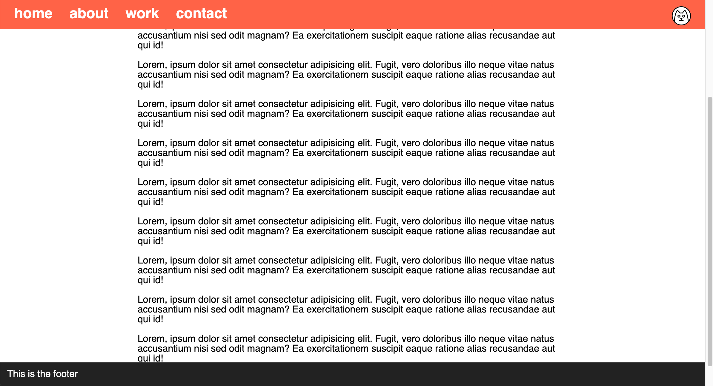

# Navigation and Footer

Create the webpage shown in the reference images below -

### Instructions 

- Create a new file called `index.html` in the project directory
- Create a new file called `style.css` in the project directory
- The page should have enough content for a vertical scrollbar to appear
- Add a navigation bar on top, it's color should be `#f35136`
- Place the cat icon on the right side of the navigation bar
- Add a footer at the bottom, it's color should be `#222`
- Both the navigation and footer must always be visible

[//]: # (autograding info start)
#  Results
> ⌛ Give it a minute. As long as you see the orange dot  on top, CodeBuddy is still processing. Refresh this page to see it's current status.
>
> This is what CodeBuddy found when running your code. It is to show you what you have achieved and to give you hints on how to complete the exercise.

### Logo

|                 Status                  | Check                                                                                    |
| :-------------------------------------: | :--------------------------------------------------------------------------------------- |
|  | should be present |
|  | should be on the right |

### Header

|                 Status                  | Check                                                                                    |
| :-------------------------------------: | :--------------------------------------------------------------------------------------- |
|  | should be present |
|  | should be 0 pixels from the top |
|  | should be as wide as the viewport |

### Footer

|                 Status                  | Check                                                                                    |
| :-------------------------------------: | :--------------------------------------------------------------------------------------- |
|  | should be present |
|  | should be at the bottom |
|  | should be as wide as the viewport |

[🔬 Results Details](../../actions)
[🐞 Tips on Debugging](https://github.com/DCI-EdTech/autograding-setup/wiki/How-to-work-with-CodeBuddy)
[📢 Report Problem](https://docs.google.com/forms/d/e/1FAIpQLSfS8wPh6bCMTLF2wmjiE5_UhPiOEnubEwwPLN_M8zTCjx5qbg/viewform?usp=pp_url&entry.652569746=UIB-box-model-navigation-and-footer)

[//]: # (autograding info end)